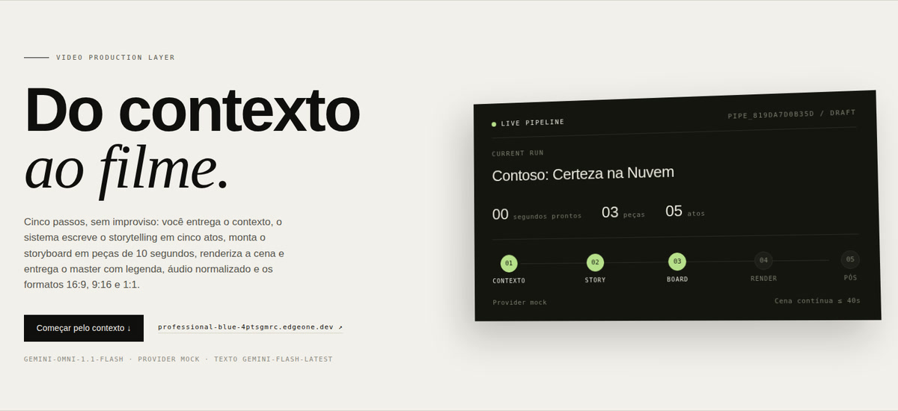
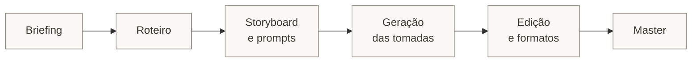
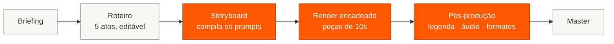

# Video Factory

**Do briefing ao master publicável, em quatro comandos e uma máquina só.**

```
Contexto → Roteiro em 5 atos → Storyboard em peças de 10s → Cena renderizada → Master 16:9 / 9:16 / 1:1
```

*Você entrega o briefing; o resto do caminho até o arquivo pronto para publicar é executado —
e cada etapa fica salva, editável e reproduzível.*

### ▶ Demo

<video src="https://github.com/juliopessan/video-factory/raw/main/docs/media/demo-30s.mp4" poster="https://raw.githubusercontent.com/juliopessan/video-factory/main/docs/images/hero.jpg" controls playsinline width="820">
  <a href="docs/media/demo-30s.mp4">Assistir ao filme de 30s (MP4)</a>
</video>

*Filme de 30 segundos saído do pipeline: três peças encadeadas, legenda tirada da locução do
storyboard e lower third do Remotion. [Assistir com som (MP4, 30s)](docs/media/demo-30s.mp4) ·
[prévia em GIF](docs/images/demo.gif)*

[](https://professional-blue-4ptsgmrc.edgeone.dev/)

---

## O cenário atual

Gerar vídeo com IA deixou de ser o gargalo. O gargalo é tudo o que existe **entre** o briefing e
um arquivo que dá para publicar: alguém escreve o roteiro, alguém traduz o roteiro em planos,
alguém escreve os prompts, alguém junta as tomadas, alguém legenda, alguém exporta a versão
vertical para o Reels. Cada passagem de bastão é um documento novo, uma conversa nova e uma
chance nova de perder a decisão que foi tomada dois passos atrás.

O resultado é um processo em que o filme de 30 segundos é rápido de gerar e lento de terminar.
Quando o cliente pede "troca o terceiro ato", ninguém sabe direito qual prompt gerou qual plano.



> A etapa criativa é a mesma de sempre. O que custa caro é ela viver espalhada em ferramentas que
> não conversam — e o filme não ter uma fonte da verdade.

---

## O que muda

As etapas continuam as mesmas, e é esse o ponto: isto não é um processo novo, é o mesmo processo
com o meio do caminho executado e versionado. **Briefing e roteiro continuam sendo decisão sua** —
o roteiro nasce escrito em cinco atos, mas você edita cada locução antes de seguir. O que muda são
as três etapas seguintes: o storyboard passa a **compilar os prompts** no template de produção, o
render **encadeia as peças** sozinho, e a pós-produção sai do "alguém edita" para um acabamento
determinístico.



Três decisões sustentam isso:

**O storyboard é o contrato.** Cada peça de 10 segundos carrega a locução em português e a direção
de câmera em inglês, e compila um prompt no template de produção (`SCENE CONTEXT`, `ACTIVE
REFERENCE`, `CHARACTERS`, `FIRST FRAME`, `FORMAT MODE`, `ACTION AND CAMERA SEQUENCE`, `LIGHTING`,
`PHYSICS`, `AUDIO`). Editou o storyboard, "Recompilar prompts" reescreve — o prompt nunca vira um
texto órfão.

**O render conhece o modelo.** Com o Gemini Omni, cada peça estende a anterior pela mesma interação
e o filme sai como uma tomada contínua. Com o Sora-2, que não estende cena, cada peça parte do
último frame da anterior e a montagem acontece no fim. O pipeline lê a capacidade do provider e
escolhe a estratégia — trocar de modelo não muda nada nos passos 1 a 3.

**O acabamento é determinístico.** Legenda, loudness, fade, enquadramento e camada de marca não
passam por modelo nenhum: é FFmpeg local, com resultado igual toda vez que rodar.

---

## O resultado

- **Uma fonte da verdade por filme.** Contexto, roteiro, storyboard, prompts, peças e exports vivem
  no mesmo projeto. "Troca o terceiro ato" vira editar um campo e recompilar.
- **Iteração barata antes do render caro.** O Draft Room gera variações em 360p lado a lado; só a
  vencedora sobe para 720p, 1080p ou 4K.
- **Publicável, não "quase pronto".** O que sai é H.264/AAC com `+faststart`, legenda como faixa
  embutida (o espectador liga e desliga), áudio a −14 LUFS e as versões 16:9, 9:16 e 1:1 — nas duas
  opções de enquadramento, porque corte central come logo de packshot.
- **Sem dependência de nuvem para o que não precisa.** Só a geração de vídeo sai da máquina.
  Roteiro, storyboard, montagem, legenda, marca e arquivos ficam em `./storage`.
- **Trocar de modelo é configuração, não reescrita.** Gemini Omni e Sora-2 no Foundry atrás do
  mesmo contrato, e um provider mock que roda o fluxo inteiro offline, sem gastar cota.

### Os números medidos

Um filme de 30 segundos, três peças, do briefing ao master, com o Gemini Omni em 360p:

| Etapa | Tempo | Observação |
|---|---|---|
| Roteiro + storyboard | 25s | `gemini-flash-latest`, 5 atos + 3 peças |
| Render das 3 peças | 174s | encadeadas: cada extensão espera a anterior |
| Export 16:9 + 9:16 + 1:1 | 100s | legenda queimada, áudio normalizado |
| Clipe avulso de 8s | 18s | 360p, 1,15 MB |

Seis suítes de teste, todas offline: `smoke`, `media`, `post`, `azure`, `keyframe`, `overlays`.

---

## Como rodar

```bash
git clone https://github.com/juliopessan/video-factory && cd video-factory
cp .env.example .env          # cole a GEMINI_API_KEY (ou as credenciais do Foundry)
./run.sh                      # cria a venv, instala e sobe em http://127.0.0.1:8000
```

Requisitos: **Python 3.11+**. Opcionais: **FFmpeg** no PATH (passo 5 — `apt install ffmpeg` /
`brew install ffmpeg`) e **Node 18+** (camadas de marca do Remotion).

Sem nenhuma credencial, o app sobe no **provider mock**: nada é enviado para fora e, se houver
FFmpeg, cada peça vira um MP4 sintético de verdade — dá para percorrer os cinco passos, exercitar
a montagem e a pós-produção sem gastar cota.

```bash
python3 tests_smoke.py     # jornada completa: contexto → render → limites de domínio
python3 tests_media.py     # duração de vídeo e corpo enviado à API por modo
python3 tests_post.py      # legendas, argv do FFmpeg, export e montagem reais
python3 tests_azure.py     # provider Sora-2 com transporte HTTP falso
python3 tests_keyframe.py  # jornada com provider que não estende cena
python3 tests_overlays.py  # camada Remotion e composição sobre o filme
```

---

## Os cinco passos, em detalhe

**1. Contexto.** Marca, produto, público, problema, ponto de virada, valor de negócio, CTA,
elenco/figurino, estética base, frame de referência e formato (duração, proporção, resolução).

**2. Storytelling.** Cinco atos — Gancho, Problema Real, Ponto de Virada, Valor de Negócio e Call
to Action — com locução em PT-BR e direção de câmera em inglês, cada um editável. Sem chave de
texto configurada, o roteiro é montado a partir do template local em vez de falhar.

Dentro dos cinco atos, a locução segue o padrão de script **intro → hook → meat → cta**:

| Beat | Onde | O que precisa fazer |
|---|---|---|
| `intro` | primeira frase do Ato 1 | situa quem fala, sobre o quê e onde, em uma linha — sem saudação nem preâmbulo |
| `hook` | ainda no Ato 1 | a tensão que segura o espectador: o risco concreto de continuar como está |
| `meat` | Atos 2, 3 e 4 | a substância: custo do jeito atual, mudança de abordagem, valor produzido |
| `cta` | Ato 5 | uma ação clara e curta |

O beat viaja com o ato: aparece na interface, define o que cada peça do storyboard cobre e entra
no prompt compilado como bloco `SCRIPT BEAT`, para o modelo saber a intenção daquele trecho — não
só o que mostrar, mas o que a cena precisa provocar.

**3. Storyboard.** Os atos viram peças de 10s. A primeira abre a cena; as seguintes continuam a
mesma tomada. Cada peça compila seu prompt no template de produção.

**4. Resultado final.** A peça 1 é gerada e cada peça seguinte só entra na fila quando a anterior
termina — a continuação depende do resultado da anterior, seja pelo `interaction_id` (Omni) ou
pelo último frame (Sora-2). Com o Omni, cada extensão devolve o filme **acumulado**: a última peça
já é o filme inteiro.

**5. Pós-produção.** FFmpeg local, sem modelo no caminho:

- **Legendas** tiradas da própria locução do storyboard — sem transcrição, os tempos saem do plano.
  Locução longa vira várias legendas dentro da janela da peça, nenhuma abaixo de 1,2s, com quebra
  de linha por formato (42 colunas no 16:9, 26 no 9:16). Três modos, e o padrão é o reversível:

  | Modo | O que faz | Quando usar |
  |---|---|---|
  | `soft` *(padrão)* | faixa `mov_text` embutida no MP4, marcada como padrão e em `por` | player, YouTube, site — o espectador liga e desliga, e o texto continua editável |
  | `burn` | desenhada nos pixels | feed do Instagram, TikTok, LinkedIn, onde não há faixa selecionável — irreversível |
  | `none` | nenhuma legenda no arquivo | quando a legenda entra depois, em outra ferramenta |

  O `.srt` é sempre gerado e fica disponível para download, nos três modos.
- **Áudio** normalizado a −14 LUFS (EBU R128), com fades opcionais.
- **Formatos** 16:9, 9:16 e 1:1, em `crop` (preenche a tela) ou `pad` (preserva o quadro).
- **Camada de marca** opcional, renderizada com Remotion e composta por cima.
- **Montagem** automática quando as peças são independentes.

O enquadramento importa mais do que parece: `crop` preenche a tela e come as laterais — um
packshot com logo centralizado perde as pontas da marca; `pad` preserva o quadro inteiro.

---

## Provedores de vídeo

| | Gemini Omni 1.1 Flash | Sora-2 (Microsoft Foundry) |
|---|---|---|
| `VF_PROVIDER` | `gemini` | `azure` |
| Credencial | `GEMINI_API_KEY` | `AZURE_OPENAI_ENDPOINT` + `AZURE_OPENAI_API_KEY` |
| Extensão de cena | sim, via `previous_interaction_id` | não — encadeia por **keyframe** |
| Resoluções | 360p → 4K | 1280x720 / 720x1280 |
| Durações | livres | 4, 8 ou 12s (arredonda para a mais próxima) |
| Referência de vídeo | até 3, ≤ 3s cada | imagem (`input_reference`) |
| Edição generativa | tasks `edit` / `extend` | *remix* de um vídeo gerado |

Chamada ao Omni, em resumo:

```python
client.interactions.create(
    model="gemini-omni-1.1-flash",
    previous_interaction_id=parent_interaction_id,   # extensão de cena
    input=[{"type": "image", ...}, {"type": "text", "text": prompt}],
    response_format={"type": "video", "resolution": "720p",
                     "aspect_ratio": "16:9", "duration": "10s", "delivery": "inline"},
    generation_config={"video_config": {"task": "text_to_video"}},
)
```

Duas regras da API descobertas em uso real e já aplicadas no código: **continuação não leva task**
(`video_config.task` junto de `previous_interaction_id` devolve 400), e **cada extensão retorna o
filme acumulado**, não só o trecho novo.

**Sobre o Sora-2:** o acesso é gated (formulário para clientes MCA-E/EA) e a API está em preview,
com dois caminhos em circulação — `/openai/v1/videos` e `/openai/v1/video/generations`. Os dois
estão implementados e `VF_AZURE_API_STYLE` escolhe. O provider foi testado com transporte HTTP
falso, **não contra um deployment real**: o primeiro render com acesso liberado dirá se caminho e
corpo estão certos.

---

## Edição automática: Kinocut + Remotion

Três tipos de edição, três caminhos:

- **Generativa** (mudar o que acontece no plano) — é o próprio modelo: `edit` e `extend` no Omni,
  *remix* no Sora-2.
- **Mecânica** (cortar, juntar, mixar, legendar, versionar) — é o passo 5, FFmpeg direto em
  `app/postproduction.py`: determinístico, testável, sem protocolo no meio.
- **Exploratória** (por conversa: *"corta os 4s mortos da peça 2 e põe legenda"*) — é onde MCP
  entra. O [`.mcp.json`](.mcp.json) da raiz já vem com os dois servidores.

### Kinocut — edição por conversa

[Kinocut](https://kinocut.dev) é um servidor MCP local com FFmpeg tipado e guardrails: 196 tools
(trim, merge, subtitles, overlay, quality-check, repurpose para Shorts/Reels). Nada sai da máquina.

```bash
pip install kinocut     # precisa de FFmpeg no PATH
kino doctor             # diz exatamente o que falta
```

Cliente MCP: `kino --mcp` — é o que está no `.mcp.json`.

### Remotion — a camada de marca

O modelo generativo erra logo e tipografia. Essa parte é desenhada em React, com fundo
transparente, e composta sobre o filme no passo 5:

```bash
cd brand-overlays && npm install
```

Duas composições prontas: **LowerThird** (marca + produto, entra animado no rodapé) e **Packshot**
(marca + claim, para o fecho). As props saem do contexto do filme e a cor de destaque vem de
`VF_BRAND_ACCENT`. A legenda sobe sozinha para não colidir com o lower third.

O render precisa do `chrome-headless-shell` (o headless antigo); se o Chrome do sistema não servir,
aponte `VF_REMOTION_BROWSER` para um binário `headless_shell`.

Kinocut e Remotion são software de terceiros: aqui foram instalados e exercitados de ponta a ponta,
mas não auditados linha a linha.

---

## Arquitetura

```
app/
  config.py          regras de domínio (10s por extensão, 40s de teto, resoluções) e settings
  db.py              SQLite: projects, generations, assets, pipelines, pipeline_renders, exports
  studio.py          validação, fila (ThreadPoolExecutor) e execução das gerações
  pipeline.py        contexto → storytelling → storyboard → render sequencial
  textgen.py         geração de JSON estruturado para roteiro e storyboard
  mediainfo.py       duração de MP4/MOV/WebM lida do cabeçalho, sem ffmpeg
  postproduction.py  passo 5: legendas, áudio, formatos, montagem e composição
  overlays.py        camadas de marca renderizadas com Remotion
  providers/
    base.py          contrato VideoRequest / VideoResult e capacidades
    gemini.py        client.interactions.create + polling até `completed`
    azure_sora.py    Sora-2 no Foundry: criar job, consultar, baixar, listar, apagar
    mock.py          clipe sintético (MP4 com FFmpeg, senão SVG) para rodar offline
  main.py            API HTTP + entrega da interface
web/                 interface (HTML + CSS + JS, sem build)
brand-overlays/      projeto Remotion: LowerThird e Packshot, fundo transparente
```

Além do pipeline, a interface traz o **Studio** (clipe avulso: texto, frame inicial, interpolação
entre primeiro e último frame, referências, extensão e upscale 1080p/4K) e o **Draft Room**
(variações em 360p lado a lado, com promoção da vencedora para a resolução final).

---

## Configuração

| Variável | Padrão | Para quê |
|---|---|---|
| `GEMINI_API_KEY` | — | chave da Gemini API |
| `AZURE_OPENAI_ENDPOINT` / `AZURE_OPENAI_API_KEY` | — | recurso do Foundry com o sora-2 |
| `VF_PROVIDER` | `auto` | `gemini`, `azure`, `mock` ou `auto` |
| `VF_MODEL` | `gemini-omni-1.1-flash` | modelo de vídeo |
| `VF_TEXT_MODEL` | `gemini-flash-latest` | modelo de texto do roteiro/storyboard |
| `VF_AZURE_DEPLOYMENT` | `sora-2` | nome do deployment no Foundry |
| `VF_AZURE_API_STYLE` | `videos` | `videos` ou `generations` |
| `VF_STORAGE_DIR` | `storage` | banco, mídias, uploads e exports |
| `VF_FFMPEG` / `VF_FFPROBE` | do `PATH` | binários usados no passo 5 |
| `VF_REMOTION_BROWSER` | do sistema | caminho de um `chrome-headless-shell` |
| `VF_BRAND_ACCENT` | `#0f6cbd` | cor de destaque das camadas de marca |
| `VF_HOST` / `VF_PORT` | `127.0.0.1` / `8000` | endereço do servidor |

---

## Notas honestas

- O custo aparece em **unidades relativas** (360p = 1/3 de 720p), não em dólares: serve para
  comparar rascunho e render final, não para faturamento.
- A duração de vídeos de referência é lida do cabeçalho do arquivo (átomo `mvhd` do MP4/MOV,
  elemento `Duration` do WebM). Contêiner que não sabemos ler passa sem o limite de 3s — melhor do
  que recusar arquivo válido por não conseguir medi-lo.
- O upscale para 1080p/4K é um novo render da mesma interação pedindo a resolução maior: a
  documentação anuncia o recurso sem nomear uma task própria.
- Sem FFmpeg, os passos 1–4 funcionam e a pós-produção aparece desabilitada, com o motivo na tela.
